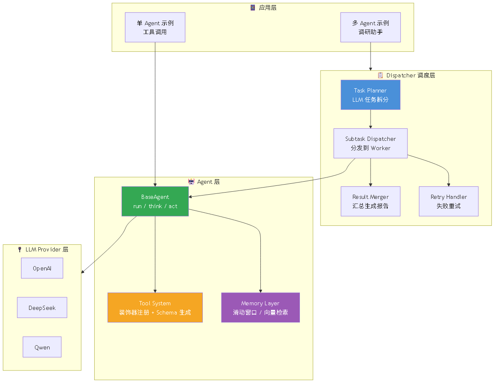

# AgentFrame — 轻量级通用 Agent 调度框架

抽离多 Agent 项目通用能力的可复用开发框架，核心约 800 行代码，定位 LangChain 的轻量替代方案，面向小型 Agent 应用快速搭建场景。

**作者**：王铎 | **GitHub**：[github.com/mokad1](https://github.com/mokad1)

---

## ✨ 核心特性

- **通用 Agent 基类**：run / think / act 标准循环，支持工具挂载、记忆注入，子类仅需覆盖 `_get_system_prompt()` 即可定制行为
- **装饰器式工具注册**：`@register_tool()` 一行装饰器注册 Python 函数为 Agent 工具，自动提取类型注解与 docstring 生成 Function Calling JSON Schema，屏蔽 OpenAI / DeepSeek / 通义千问三家格式差异
- **模块化记忆抽象**：统一 `add / get_context / clear` 接口，内置滑动窗口记忆、向量检索记忆、无记忆三种实现，支持自由切换与组合
- **多 Agent 调度器**：LLM 自动拆分复杂任务→分发到指定 Worker Agent→汇总生成最终报告，内建失败重试
- **原生多模型兼容**：OpenAI / DeepSeek / 通义千问，Pydantic v2 统一配置管理，切换仅需改环境变量
- **内置 6 款基础工具**：calculator / read_file / write_file / current_time / str_length / json_parser，开箱即用

---

## 🏗️ 架构设计

```
┌──────────────────────────────────────────────────┐
│                 应用层 (examples/)                 │
│   single_agent_demo.py / multi_agent_demo.py     │
├──────────────────────────────────────────────────┤
│              Dispatcher 调度层                     │
│   任务规划 → 子任务分发 → 结果汇总 → 失败重试       │
├─────────────────┬────────────────────────────────┤
│  Agent 层        │  记忆层 (Memory)                │
│  BaseAgent      │  ├─ BaseMemory (抽象接口)        │
│  ├─ run()       │  ├─ SlidingWindowMemory        │
│  ├─ think/act   │  └─ VectorMemory               │
│  ├─ mount_tools │                                 │
│  └─ mount_memory│                                 │
├─────────────────┤                                  │
│  工具层 (Tools)  │                                  │
│  ├─ ToolRegistry│                                  │
│  ├─ @register   │                                  │
│  └─ Schema 生成 │                                  │
├─────────────────┴────────────────────────────────┤
│            LLM Provider 适配层                     │
│  OpenAI / DeepSeek / Qwen                         │
│  统一 Function Calling 格式适配                    │
└──────────────────────────────────────────────────┘
```



**分层职责**：
- **Provider 层**：封装 LLM HTTP 调用，统一三家模型 Function Calling 格式差异，内部用标准 OpenAI tools/tool_choice 格式
- **工具层**：`ToolRegistry` 单例管理全局工具，`@register_tool` 装饰器从函数签名自动生成 JSON Schema
- **记忆层**：`BaseMemory` 定义统一操作接口，`SlidingWindowMemory` 用 deque 维护近期消息，`VectorMemory` 用 FAISS 做语义检索
- **Agent 层**：`BaseAgent.run(task)` 触发 think/act 循环，LLM 决定调用工具或输出最终答案
- **调度层**：`Dispatcher` 调用 LLM 做任务规划→分发到已注册 Worker→聚合结果，子任务失败自动重试

---

## 🚀 快速开始

### 环境要求

- Python 3.10+
- 可选：向量记忆功能需安装 faiss-cpu

### 安装

```bash
git clone https://github.com/mokad1/agent-frame.git
cd agent-frame
pip install -r requirements.txt
```

### 配置

```bash
cp .env.template .env
# 编辑 .env，填入 LLM_API_KEY
```

### 5 分钟上手

```python
import asyncio
from agent_frame.llm.providers import get_provider
from agent_frame.core.agent import BaseAgent
from agent_frame.tools.registry import ToolRegistry
from agent_frame.tools.builtin import register_builtin_tools

async def main():
    provider = get_provider()
    registry = ToolRegistry()
    register_builtin_tools(registry)

    agent = BaseAgent(provider, name="demo")
    agent.mount_tools(registry)

    result = await agent.run("计算 (3+5)*12/4")
    print(result)  # "计算结果为 24.0"

asyncio.run(main())
```

### 运行示例

```bash
python examples/single_agent_demo.py   # 单 Agent 工具调用（计算器+文件读写）
python examples/multi_agent_demo.py    # 多 Agent 协作调研助手
pytest tests/ -v                       # 单元测试（30 条）
```

### 自定义 Agent

```python
from agent_frame.core.agent import BaseAgent

class MyAgent(BaseAgent):
    def _get_system_prompt(self) -> str:
        return "你是一个专业的 Python 开发者助手..."
```

### 注册自定义工具

```python
from agent_frame.tools.registry import register_tool

@register_tool()
def web_search(query: str) -> str:
    """搜索网页内容。query: 搜索关键词"""
    return f"Search results for: {query}"
```

---

## 📊 评测与效果

### 测试前提

| 条件 | 说明 |
|------|------|
| 对比基准 | 从零硬编码实现同功能 Agent 应用（纯 Python + 手动 Function Calling） |
| 验证场景 | 单工具调用 Agent、简单多 Agent 调研助手 |
| 测试模型 | DeepSeek-V3 |
| 运行环境 | 本地 Windows |

### 工程指标

| 指标 | 测量值 | 说明 |
|------|--------|------|
| 业务代码量减少 | **~65%** | 基于本框架搭建单 Agent 应用 vs 硬编码实现 |
| 调度层额外开销 | **< 50 ms** | 工具调用 overhead |
| 原生兼容模型 | **3 款** | OpenAI / DeepSeek / 通义千问 |
| 内置工具 | **6 款** | 开箱即用，支持零代码扩展 |
| 核心代码量 | **~800 行** | 不含注释和空行 |
| 单元测试 | **30 条全通过** | 覆盖 agent / tools / memory / dispatcher |
| 测试覆盖率 | **~65%** | 核心模块 |

---

## ⚠️ 项目局限性

- **定位限制**：轻量级框架，面向小型 Agent 应用快速搭建，不支持复杂分布式多 Agent 编排
- **工具生态**：内置 6 款基础工具，远不如 LangChain 数百款预置工具，复杂场景需自行扩展
- **工业级特性**：暂不支持可视化流程编排、持久化任务队列、流式输出、精确 Token 计数
- **安全模型**：工具执行在 Agent 同一进程中，无沙箱隔离，不可信代码需额外防护
- **测试覆盖**：核心模块 ~65% 覆盖率，边界场景和集成测试仍需补充
- **设计取舍**：优先保证透明性和可控性，牺牲生态完整性和开箱即用程度

---

## 📁 项目目录结构

```
agent-frame/
├── agent_frame/
│   ├── config.py                 # Pydantic v2 统一配置
│   ├── core/
│   │   ├── agent.py              # BaseAgent（run / think / act 循环）
│   │   └── dispatcher.py         # 多 Agent 调度器
│   ├── tools/
│   │   ├── registry.py           # 工具注册中心 + Schema 自动生成
│   │   └── builtin.py            # 6 款内置工具
│   ├── memory/
│   │   ├── base.py               # 记忆抽象接口
│   │   ├── sliding_window.py     # 滑动窗口记忆
│   │   └── vector_memory.py      # 向量检索记忆
│   ├── llm/
│   │   ├── base.py               # Provider 抽象
│   │   └── providers.py          # OpenAI / DeepSeek / Qwen
│   └── utils/
│       └── logger.py
├── tests/                        # 单元测试（4 个文件、30 条用例）
├── examples/                     # 运行示例（2 个脚本）
├── requirements.txt
├── .env.template
└── README.md
```

---

## 🖥️ 在线 Demo

【部署后填入 Streamlit 链接】

---

## 📸 运行截图


*单 Agent 工具调用示例：计算器工具执行 + 迭代日志*


*多 Agent 调度器：任务规划→子任务分发→结果汇总*


*30 条单元测试全通过：agent / tools / memory / dispatcher*

---

## 📄 License

MIT License — 适用于个人项目和简历展示。
